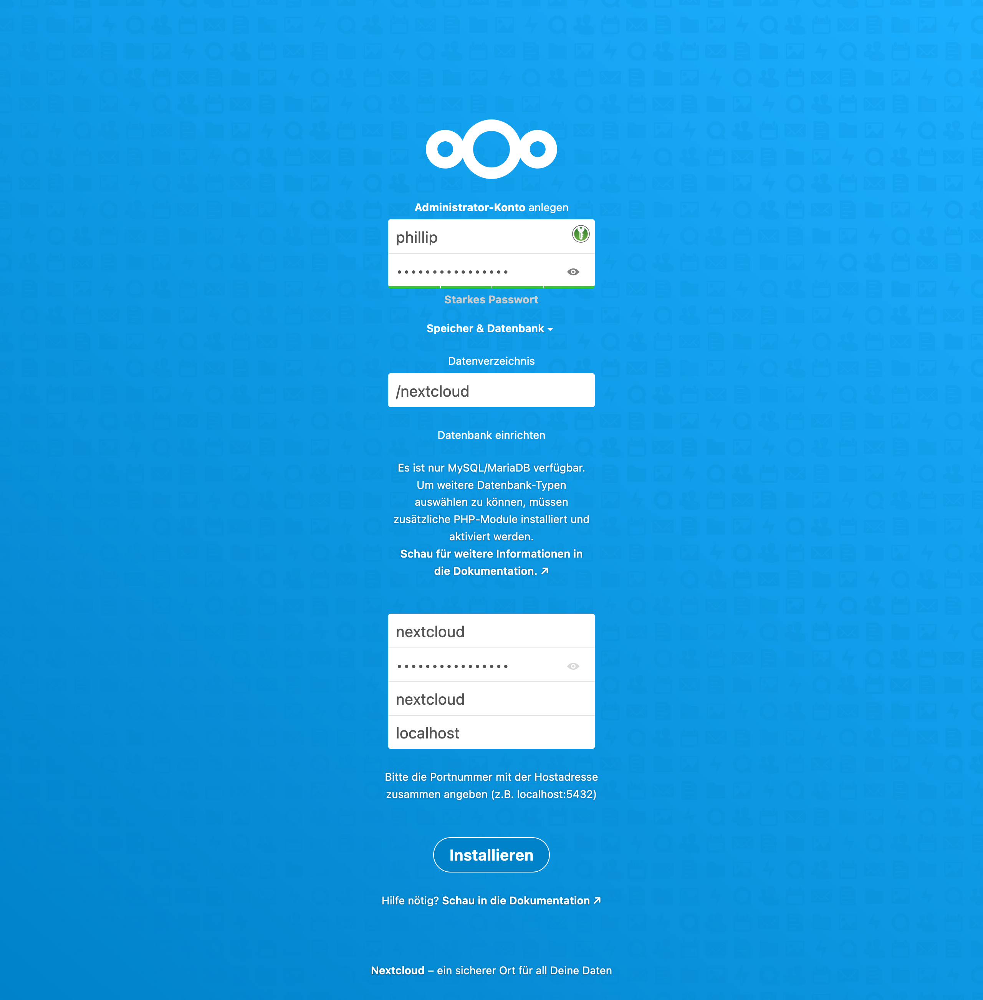

[TOC]

## Pakete installieren

```bash
apt install libapache2-mod-php php php-cli php-xml php-zip php-curl php-gd php-cgi php-mysql php-mbstring php-bz2 php-intl php-bcmath php-gmp php-imagick libmagickcore-6.q16-6-extra
```

## PHP

### Konfiguration

```bash
nano /etc/php/7.4/apache2/php.ini
```

<pre>
...
date.timezone = Europe/Berlin
...
memory_limit = 512M
...
upload_max_filesize = 512M
...
post_max_size = 512M
...
max_execution_time = 300
...
</pre>

## MariaDB

[MariaDB Datenbank und Benutzer anlegen](../mariadb#datenbank-und-benutzer-an)

## Nextcloud Installation

### Archiv herunterladen

```bash
wget https://download.nextcloud.com/server/releases/latest-23.zip
```

### Archiv entpacken

```bash
unzip latest-23.zip
```

### Ordner verschieben

```bash
mv nextcloud/ /var/www/
```

### Eigentümer setzen

```bash
chown -R www-data:www-data /var/www/nextcloud
```

### Datenverzeichnis erstellen

```bash
mkdir /nextcloud
```

### Eigentümer setzen

```bash
chown www-data:www-data /nextcloud
```

## Apache2

[Apache2 Installation](../apache2)

### Module aktivieren

```bash
a2enmod rewrite headers env dir mime
```

### VHost anlegen

```bash
nano /etc/apache2/sites-available/nextcloud.premmert.de.conf
```

<pre>
DEFINE server_name nextcloud.premmert.de

&lt;VirtualHost *:80&gt;
	ServerName  ${server_name}

	Redirect permanent / https://${server_name}/
&lt;/VirtualHost&gt;

&lt;VirtualHost *:443&gt;
	ServerName  ${server_name}

	DocumentRoot /var/www/nextcloud/

	&lt;Directory /var/www/nextcloud/&gt;
		Require all granted
		AllowOverride All
		Options FollowSymLinks MultiViews

		&lt;IfModule mod_headers.c&gt;
			Header always set Strict-Transport-Security "max-age=15552000; includeSubDomains"
		&lt;/IfModule&gt;

		&lt;IfModule mod_dav.c&gt;
			Dav off
		&lt;/IfModule&gt;
	&lt;/Directory&gt;

	SSLEngine on
	SSLCertificateFile    /etc/acme.sh/certificates/premmert.de.fullchain.pem
	SSLCertificateKeyFile /etc/acme.sh/certificates/premmert.de.key.pem

	LogLevel info
	ErrorLog ${APACHE_LOG_DIR}/${server_name}_error.log
	CustomLog ${APACHE_LOG_DIR}/${server_name}_access.log combined
&lt;/VirtualHost&gt;
</pre>

### VHost aktivieren

```bash
a2ensite nextcloud.premmert.de.conf
```

### Dienst neu starten

```bash
systemctl restart apache2
```

## Nextcloud

### Installationsassistent

Im Browser aufrufen:
<https://nextcloud.premmert.de/>



### Konfiguration

#### Pretty-URLs

```bash
nano /var/www/nextcloud/config/config.php
```

<pre>
...
  'overwrite.cli.url' => 'https://nextcloud.premmert.de/',
  'htaccess.RewriteBase' => '/',
...
</pre>

#### Standard Telefonregion

```bash
nano /var/www/nextcloud/config/config.php
```

<pre>
...
  'default_phone_region' => 'DE',
...
</pre>

#### Änderungen übernehmen

```bash
su -m www-data -c "php /var/www/nextcloud/occ maintenance:update:htaccess"
```

<pre>
.htaccess has been updated
</pre>

#### Crontab

```bash
crontab -u www-data -e
```

<pre>
*/5  *  *  *  * /usr/bin/php -f /var/www/nextcloud/cron.php
</pre>

### Apps

#### Installieren

* Dateien
* * Extract
* Organisation
* * Bookmarks
* Tasks

#### Deinstallieren

* Accessibility
* Activity
* Circles
* Collabora Online - Built-in CODE Server
* Collaborative tags
* Comments
* Dashboard
* Federation
* First run wizard
* Mail
* Nextcloud announcements
* Nextcloud Office
* Password policy
* Privacy
* Recommendations
* Support
* Talk
* Theming
* Usage survey
* User status
* Weather status

### Programm-Einstellungen

#### Persönliche Informationen

Vollständiger Name: Phillip
E-Mail: phillip@premmert.de
Gebietsschema: German

#### Benachrichtigungen

E-Mail-Erinnerungen für unbearbeitete Benachrichtigungen senden nach: Niemals

#### Übsersicht

Es dürfen keine Sicherheits- & Einrichtungswarnungen vorhanden sein.

#### Grundeinstellungen

Hintergrund-Aufgaben
	Cron aktivieren

E-Mail-Server
	Sendemodus: SMTP
	Verschlüsselung: Keine
	Absenderadresse: nextcloud@premmert.de
	Authentifizierungsmethode: Keine
	Serveradresse: localhost:25
	Test E-Mail senden!

#### Groupware

Benachrichtigungen für Termine per Push aktivieren.

### Anderes

Standard Dateien löschen.